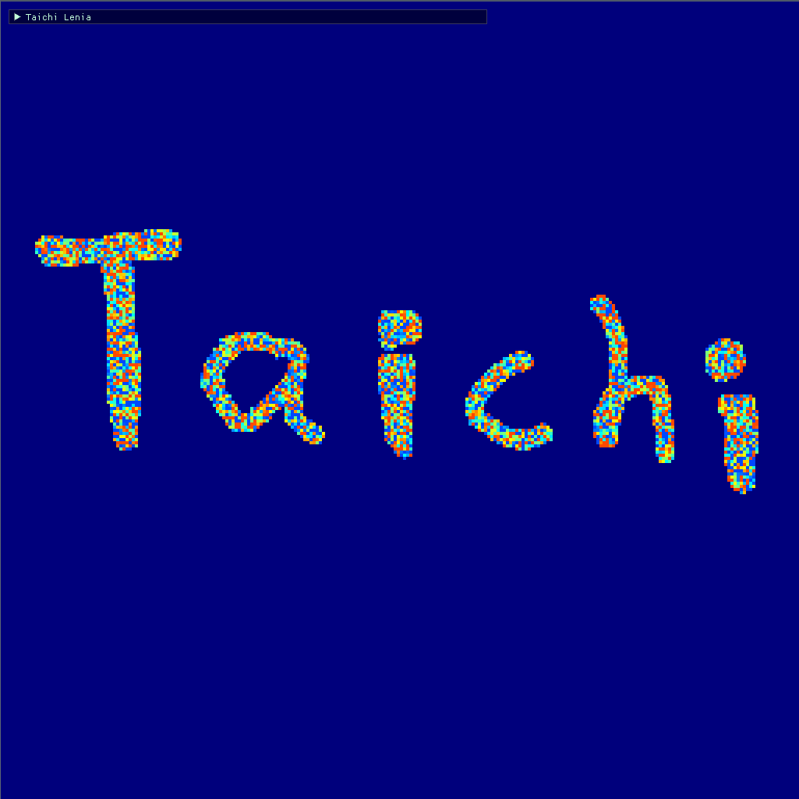

# 太极图形课S1-大作业

## 作业来源

 Lenia 是康威生命游戏（Game of Life，GoL）在连续空间数学推广。在GoL中，每个格子的下一状态由周围八个格子在这一时刻的状态和自身的状态决定，人们在其中发现了像是Glider, Still life, Oscillators，以及更复杂的结构如Glider Gun，Life in Life等。在此之后，不断有人尝试推广GoL的规则，如Larger-that-Life, SmoothLife. 而Lenia则将生命游戏推广至连续的时间和空间之中，原本周围八个格子的状态被推广至邻域，而生长函数也做了平滑处理，通过这些抽象，出现了具有复杂行为，如平动、旋转、复制、躲避等和复杂外观，如轴对称，五角体，六角体等的生物。

 这次大作业的是对Lenia原始论文的复现，主要利用了Taichi语言的并行特性来进行运算操作，从而了解Lenia的基础逻辑，其中包括了卷积核的组装，卷积操作，生长函数等部分。
 
 来源：
 
 Chan, Bert Wang-Chak. “Lenia: Biology of Artificial Life.” Complex Systems 28, no. 3 (October 15, 2019): 251–86. [PDF](https://doi.org/10.25088/ComplexSystems.28.3.251)


## 运行方式

#### 运行环境：
<!-- > 请列出`Taichi`程序运行环境，可以在命令行中输入命令：`$ ti`，然后复制输出的第一行。 -->
```
[Taichi] version 0.8.8, latest version 0.8.9, llvm 10.0.0, commit 7bae9c77, win, python 3.8.5
```

#### 运行：
<!-- > 请列出哪些代码可以运行以及如何运行，如果有命令行参数可以列出参数以及参数对应的含义。 -->

```
python ./Lenia-taichi.py
```
在实例初始化中，包含的参数有：

1. `res` 决定lenia世界的大小
2. `scatter` 每个像素的显示大小
3. `conv_r` 卷积核的尺寸
4. `time` 更新周期，时间步长`dt=1/time`
5. `mu` 生长函数的参数，可以理解为正态分布的期望值，决定了lenia生物对环境的平均要求
6. `sig` 生长函数的参数，可以理解为正态分布的标准差，决定了Lenia生物对环境的适应宽度
7. `kr` 卷积核的阶数
8. `kb`卷积核每一阶的权重

## 效果展示
<!-- > 这里可以展示这份作业运行起来后的可视化效果，可以让其他人更直观感受到你的工作。可以是**图片**（比如渲染效果）、**动图**或**视频**。 -->
`kernel_beta=[1]`



`kernel_beta=[1/2, 1]`


## 整体结构
<!-- > 脉络清晰的结构能完整展示你的设计思想，以及实现方式，方便读者快速代入。Python的代码，可以使用命令：`yapf -i xx.py`来格式化。可以在repo的目录中包含如下内容： -->
```
-LICENSE
-|data
-README.MD
-Lenia-taichi.py
```

## 实现细节：
<!-- > 请给出代码的具体实现流程和细节，让感兴趣的人能够更深入的了解你的代码。 -->

项目源代码中包含两个类，`ColorMap`类主要对结果进行可视化，这个类复制自[Taichi论坛](https://forum.taichi.graphics/t/vortex-method-demo/775/2)，在此表示感谢。`Lenia`类则是作业的主干，具体公式见原文章。

### 整体流程
1. Lenia世界的初始化
2. 根据参数初始化卷积核，`kernel_core`函数决定了卷积核的分布特点，`kernel_shell`函数则决定了卷积核的外部轮廓
3. 将组装的卷积核与当前的Lenia世界进行卷积操作，并将卷积操作的结果传入生长函数
4. 更新世界，根据生长函数的结果和时间步长得到世界的更新量
5. 在GUI中显示Lenia世界


